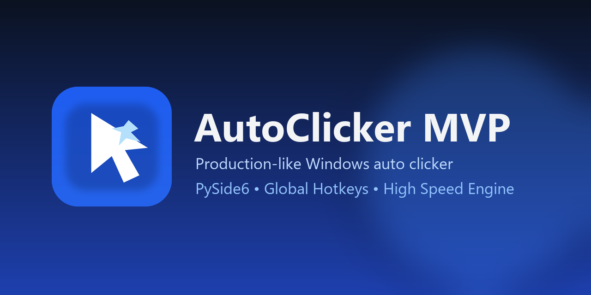

# AutoClicker MVP

Production-like Windows auto clicker with polished PySide6 UI, global hotkeys, reliable state machine, and high-speed click engine.




## Why this project

- Fast click engine with support for **0 ms interval** (maximum speed mode).
- Global hotkeys (`F6/F7/F8/F9`) work even when app window is unfocused.
- Clean non-blocking architecture (`QThread` + service layer + validation).
- Single-instance protection and graceful shutdown of threads/hotkeys.
- Ready-to-download `.exe` from GitHub Releases.

If this tool saves you time, give it a star.

## Features

- Click modes:
  - Saved point.
  - Current cursor position.
- Mouse buttons:
  - Left.
  - Right.
  - Middle.
- Click count:
  - Fixed number.
  - Infinite mode.
- Controls:
  - Start / Stop / Pause / Resume.
- Built-in coordinate capture and event log.
- Clear user-facing validation errors.

## Quick Download

1. Open the [Releases](../../releases) page.
2. Download `AutoClickerMVP-win64.zip`.
3. Unzip and run `AutoClickerMVP.exe`.

## Hotkeys

| Key | Action |
|---|---|
| `F6` | Start |
| `F7` | Stop |
| `F8` | Pause / Resume |
| `F9` | Capture cursor coordinates |

## Run from source

```powershell
python -m venv .venv
.venv\Scripts\activate
pip install -r requirements.txt
python main.py
```

## Build EXE locally

```powershell
python -m venv .venv
.venv\Scripts\activate
pip install -r requirements.txt
python -m PyInstaller --noconfirm --clean --windowed --name AutoClickerMVP --icon assets/branding/app_icon.ico main.py
```

Output:

- `dist\AutoClickerMVP\AutoClickerMVP.exe`

## One-command branding generation

```powershell
python scripts/generate_brand_assets.py
```

Generated files:

- `assets/branding/app_icon.ico`
- `assets/branding/app_icon_256.png`
- `assets/branding/app_icon_512.png`
- `assets/branding/app_icon_1024.png`
- `assets/branding/wordmark.png`
- `assets/branding/social_preview.png`

## Project structure

```text
main.py
config.py
core/
  clicker_service.py
  hotkey_service.py
  models.py
  validators.py
ui/
  main_window.py
assets/
  branding/
scripts/
  generate_brand_assets.py
```

## Release automation (GitHub Actions)

Push a tag like `v1.0.0` to trigger Windows build and publish release assets:

```powershell
git tag v1.0.0
git push origin v1.0.0
```

Workflow file: `.github/workflows/release.yml`

## License

MIT — see [LICENSE](LICENSE).
